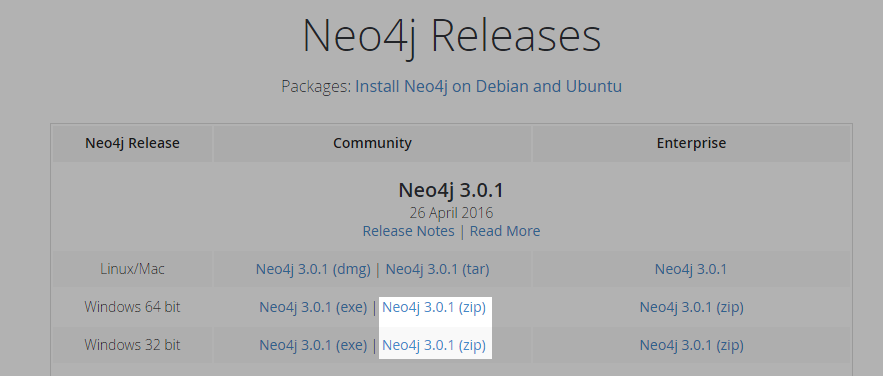
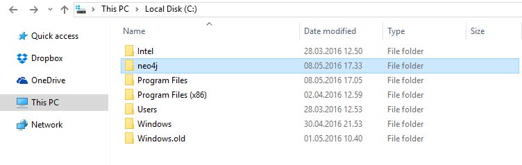
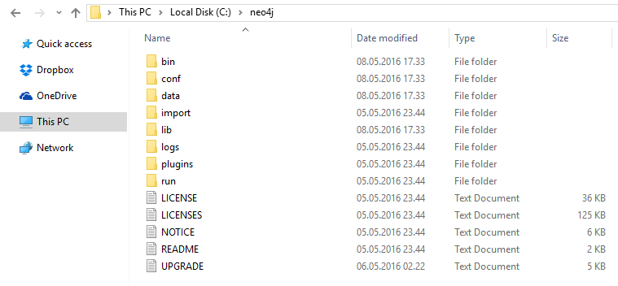
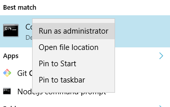

# Neo4J

## Setup - Windows

### Download and install

Go download [Neo4j](http://neo4j.com/download/other-releases/) and select the *.zip* file for your system (x64 or x32).

Extract the package you downloaded and move it to the root of your `C:\`-drive and rename it to `neo4j`.

Your `C:\`-drive should look something like the following image.

And your `neo4j`-folder should look something like this:

### Starting Neo4j for the first times

To start Neo4j, simply open a terminal window in __administrator mode__. You can do this by:

1. Clicking *Start* and typing `cmd` in the search-box.
2. Either pressing *CTRL+SHIFT+ENTER* or by right-clicking `cmd` and select *Run as administrator*

Type `cd c:\neo4j\bin` in the terminal window and then `neo4j.bat install-service` to set up the Neo4j-windows service.

Now you can start Neo4j by typing `neo4j start`.

Neo4j will start running on [localhost:7474](http://localhost:7474). This is where we will preform most of our queries.

Head over to your local Neo4j instance. If you are asked for a username/password, use the default `neo4j/neo4j`.

If you are not asked for a username/password, you might not be connected to Neo4j. If so, just type `:server connect` in the query-field.

You might be promted to create a new password. Make it something simple for now, so you will remember it. This password might come in handy at a later time.

You can shut down Neo4j by typing `neo4j stop` at `c:\neo4j\bin` in a terminal window.

### Importing the database

Open up terminal window in __administrator mode__ and navigate to the root of this project and in to the neo4j-data folder `{Your path}\databasekurs\neo4j\data`. Here you can simply run `import.bat`.

This will import the *csv* files with all the juicy data that we will query.

*__ALL PROPERTIES IN THE DATABASE ARE IN NORWEGIAN!__*
*This means that f.eks. the `name` property of the `Country`-node for South Africa is "Sør Afrika".*

Alright, you are now ready to scroll down to the [exercises](README.md)!
